# Multi-Site Enterprise Network Lab

A hands-on networking lab built in **Cisco Packet Tracer** to practise designing, configuring and troubleshooting an enterprise-style network.

The lab consists of a Headquarters site and a Branch site connected over a WAN. I’m building the network in stages, starting with the core infrastructure and gradually adding security, network services and automation.

---

## Latest Update

**Network Services, Topology Redesign & Security Hardening**

Since the last update, I’ve expanded the network quite a bit. I replaced the original single server with a small internal server farm, added a separate public DMZ, introduced DHCP, DNS, Syslog and NTP, and added Extended ACLs to control traffic between the different network segments.

I also tested a couple of different firewall approaches in Packet Tracer before settling on Extended ACLs because of simulation limitations with the ASA and Zone-Based Firewall options.

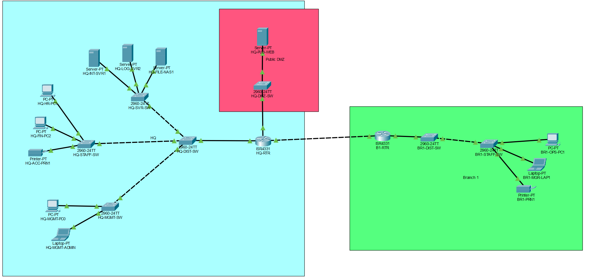

---

## End Goal

The end goal is to build a multi-site enterprise network that includes:

* Multiple VLANs for different departments and services
* Inter-VLAN routing
* Dynamic routing between sites using OSPF
* An internal server network
* A separate public DMZ
* ACLs to control traffic between network segments
* Basic switch security and hardening
* Network services such as DHCP and DNS
* Centralised logging and time synchronisation
* Python/Netmiko automation for tasks such as configuration backups

The aim is to use the lab to practise the full process of building a network, configuring it, testing it, troubleshooting problems and gradually making it more secure and automated.

---

# Progress

## 1. Initial Topology

I created the initial multi-site topology in Cisco Packet Tracer with a Headquarters site and a Branch site.

The two sites are connected using a point-to-point serial WAN connection between `HQ-RTR` and `B1-RTR`.

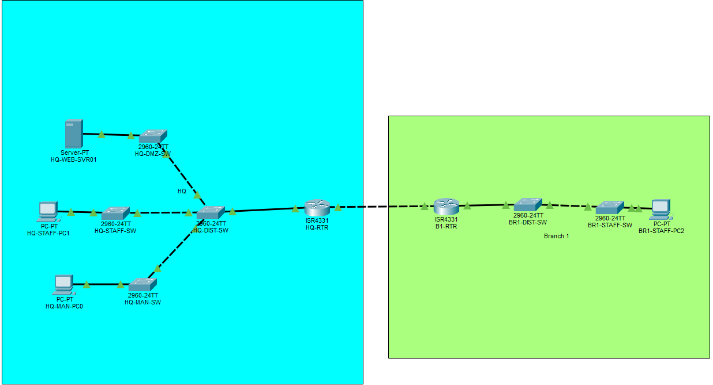

The original devices were:

### Headquarters

* `HQ-RTR` — Cisco ISR 4331
* `HQ-DIST-SW` — Cisco Catalyst 2960
* `HQ-DMZ-SW` — DMZ/server switch
* `HQ-STAFF-SW` — Staff access switch
* `HQ-MAN-SW` — Management access switch
* `HQ-STAFF-PC1` — Staff PC
* `HQ-MAN-PC0` — Management PC

### Branch 1

* `B1-RTR` — Cisco ISR 4331
* `BR1-DIST-SW` — Distribution switch
* `BR1-STAFF-SW` — Staff access switch
* `BR1-STAFF-PC2` — Staff PC

The topology has since been expanded with additional servers and a separate DMZ, which is documented below.

---

## 2. VLANs

I separated the different network segments into their own VLANs:

| VLAN | Purpose          | Network           |
| ---- | ---------------- | ----------------- |
| 10   | Management       | `192.168.10.0/24` |
| 20   | HQ Staff         | `192.168.20.0/24` |
| 30   | Internal Servers | `192.168.30.0/24` |
| 40   | Branch Staff     | `192.168.40.0/24` |

This gives each segment its own broadcast domain and provides a foundation for controlling traffic between them.

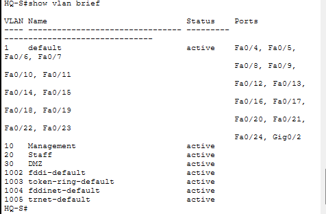

---

## 3. Trunking

I configured the relevant links as **802.1Q trunks** so that traffic from multiple VLANs can travel across the same physical links while keeping the VLANs logically separated.

Example configuration:

```text
interface FastEthernet0/1
 switchport mode trunk
```

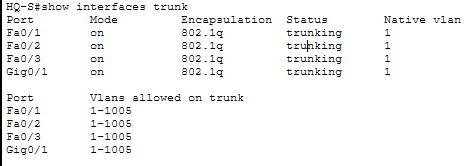

I verified the trunk configuration using:

```text
show interfaces trunk
```

---

## 4. Inter-VLAN Routing

I used **Router-on-a-Stick** to allow the different VLANs to communicate through the router.

The physical router interface is divided into subinterfaces, with each one acting as the default gateway for a VLAN.

Example configuration:

```text
interface GigabitEthernet0/0/0.10
 encapsulation dot1Q 10
 ip address 192.168.10.1 255.255.255.0

interface GigabitEthernet0/0/0.20
 encapsulation dot1Q 20
 ip address 192.168.20.1 255.255.255.0

interface GigabitEthernet0/0/0.30
 encapsulation dot1Q 30
 ip address 192.168.30.1 255.255.255.0
```

The Branch router uses the same approach for VLAN 40.

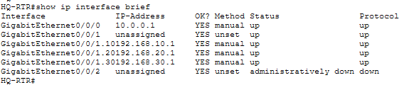

I verified the interfaces using:

```text
show ip interface brief
```

---

## 5. OSPF

I configured **OSPF Area 0** between `HQ-RTR` and `B1-RTR`.

The routers are connected using the `10.0.0.0/30` WAN network.

Using OSPF means the routers can dynamically learn about the networks at the other site instead of relying on manually configured static routes.

I verified the OSPF neighbour relationship with:

```text
show ip ospf neighbor
```

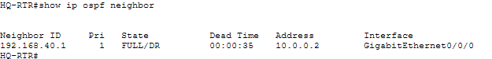

I also checked the routes being learned through OSPF using:

```text
show ip route ospf
```

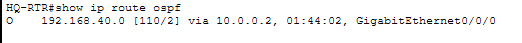

---

## 6. Connectivity Testing

Once the routing was configured, I tested connectivity across the network.

One of the end-to-end tests was from the Branch staff PC to an internal HQ server:

```text
BR1-STAFF-PC2 -> 192.168.30.30
```

The traffic has to travel from the Branch network, through `B1-RTR`, across the WAN, through `HQ-RTR` and finally into the internal server network.

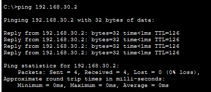

This confirmed that the VLANs, routing and WAN connection were working together correctly.

---

## 7. Server Farm & DMZ Redesign

I expanded the original server setup to separate the different server roles instead of using one multipurpose server.

### Internal Server Network

The internal server network remains on **VLAN 30 (`192.168.30.0/24`)**.

| Device          | IP Address      | Role                      |
| --------------- | --------------- | ------------------------- |
| `HQ-INT-SVR01`  | `192.168.30.10` | DHCP and internal DNS     |
| `HQ-LOG-SVR02`  | `192.168.30.20` | Syslog and NTP            |
| `HQ-FILE-NAS01` | `192.168.30.30` | Intranet and file storage |

### Public DMZ

I also separated public-facing services from the internal server network by creating a dedicated routed DMZ:

```text
172.16.10.0/24
```

`HQ-RTR` connects to the DMZ using:

```text
GigabitEthernet0/0/2
172.16.10.1/24
```

The public-facing server is:

```text
HQ-PUB-WEB01
172.16.10.10
```

The purpose of this separation is to prevent a public-facing server from sitting directly on the internal server network.

---

## 8. Network Services

### DHCP

I configured `HQ-INT-SVR01` as the central DHCP server.

Separate DHCP scopes were created for:

* HQ Staff — `192.168.20.0/24`
* Branch Staff — `192.168.40.0/24`

The Branch router uses DHCP relay to forward client DHCP requests to the central server:

```text
ip helper-address 192.168.30.10
```

This allows Branch clients to obtain their addresses from the central DHCP server across the WAN.

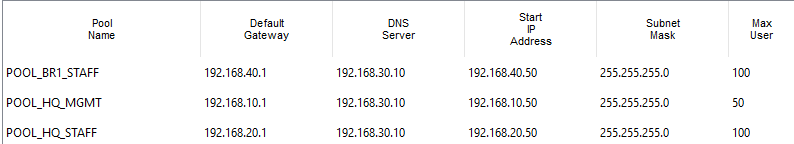

### DNS

I configured `HQ-INT-SVR01` as the internal DNS server and added records for internal services.

For example:

```text
intranet.hq.local -> 192.168.30.30
```

This gives the internal network a simple way to resolve services by name rather than having to rely on IP addresses.


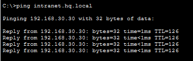

### Syslog & NTP

I configured `HQ-RTR` to send logging information to `HQ-LOG-SVR02` using Syslog over UDP 514.

I also configured timestamps on the router:

```text
service timestamps log datetime msec
service timestamps debug datetime msec
```

This provides useful date and time information in the generated logs.

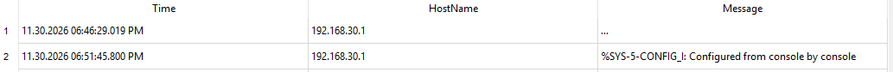

---

## 9. Extended ACLs

After initially experimenting with other firewall approaches in Packet Tracer, I decided to use **Extended ACLs** to control traffic between the different network segments.

The ACLs are applied to the router interfaces and subinterfaces to restrict unwanted traffic while still allowing required services such as DNS, DHCP, HTTP/HTTPS, NTP and ICMP.

### Main ACLs

| ACL                   | Interface                    | Purpose                                                                           |
| --------------------- | ---------------------------- | --------------------------------------------------------------------------------- |
| `ACL-STAFF-IN`        | HQ Staff subinterface        | Restricts Staff access to Management and controls permitted services              |
| `ACL-SRV-IN`          | Internal Server subinterface | Prevents servers from initiating unwanted connections into internal user networks |
| `ACL-BRANCH-STAFF-IN` | Branch Staff subinterface    | Restricts Branch access to HQ internal networks                                   |
| `ACL-DMZ-IN`          | DMZ interface                | Prevents DMZ hosts from initiating connections into internal networks             |
| `ACL-DMZ-OUT`         | DMZ interface                | Controls which external traffic can reach the public web server                   |

For TCP connections, I also used the `established` keyword where appropriate to allow return traffic without opening unnecessary inbound access.

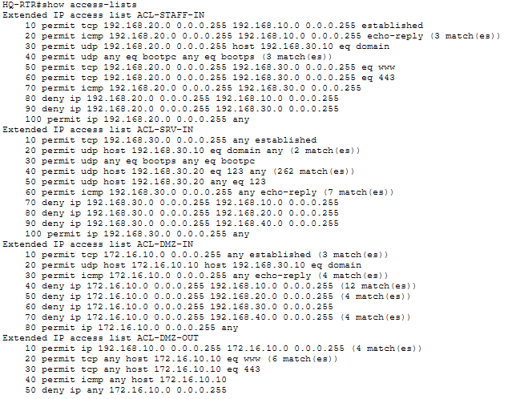

---

## 10. Firewall Testing in Packet Tracer

Before settling on Extended ACLs, I explored two other approaches.

### Cisco ASA

I looked at using a Cisco ASA 5506-X as a dedicated firewall between the WAN, DMZ and internal networks.

The problem was that Packet Tracer's ASA simulation does not support the subinterface/trunk configuration I needed to integrate it cleanly with the existing Router-on-a-Stick design.

### Zone-Based Firewall

I also tested Cisco IOS Zone-Based Firewall functionality on `HQ-RTR`.

This allowed me to work with concepts such as:

* `class-map`
* `policy-map`
* `zone-pair`
* Stateful inspection

However, Packet Tracer would not allow the Router-on-a-Stick subinterfaces to be assigned to security zones in the way required for this topology.

Because of these limitations, I used Extended ACLs as the final solution for the lab.

This still allowed me to practise granular traffic filtering and build a more controlled network than the original open routing setup.

---

# Problems & Troubleshooting

## 1. Native VLAN Mismatch

While connecting the downstream switches to `HQ-DIST-SW`, I started receiving CDP errors about a native VLAN mismatch.

The error looked similar to:

```text
%CDP-4-NATIVE_VLAN_MISMATCH:
Native VLAN mismatch discovered on FastEthernet0/1 (1),
with HQ-DIST-SW FastEthernet0/2 (20).
```

### What I found

The links between the switches were not configured consistently.

The distribution switch was using VLAN-specific configuration while the downstream switches were still using their default VLAN configuration.

### Fix

I configured the relevant switch-to-switch links as trunks:

```text
switchport mode trunk
```

I also made sure the required VLANs existed on the connected switches.

### What I learned

I initially assumed the downstream switches could be connected like simple access switches.

The issue showed me that I need to consider what traffic actually needs to cross each link and make sure the Layer 2 configuration is correct on both ends.

I also got some practical experience using CDP messages to help identify a configuration problem.

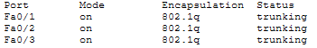

> The screenshot shows the current corrected configuration. I did not capture the original error while I was building the lab.

---

## 2. Syslog Timestamps

### Problem

Syslog messages from `HQ-RTR` were reaching `HQ-LOG-SVR02`, but the date and time information was missing.

### What I found

The router needed explicit timestamp configuration so that the logs included useful clock information.

### Fix

I configured:

```text
service timestamps log datetime msec
service timestamps debug datetime msec
```

### What I learned

Getting logs to a central server is only part of making them useful. Accurate timestamps are important when trying to understand the order and timing of events during troubleshooting.


---

## 3. OSPF Route Issue

### Problem

After making changes to the firewall configuration and router interfaces, the Branch staff network stopped being reachable from HQ.

Branch clients also stopped receiving DHCP addresses.

Pings from `B1-RTR` to `10.0.0.1` were also failing when sourced from VLAN 40.

### What I found

The OSPF routing information was no longer correctly advertising the `192.168.40.0/24` Branch network after the interface changes.

This appeared to be related to how Packet Tracer was handling the updated OSPF state after the subinterface changes.

### Fix

I removed and reapplied the OSPF network statement on `B1-RTR`, which forced the routing information to be recalculated.

The route to `192.168.40.0/24` then appeared again on `HQ-RTR` and connectivity was restored.

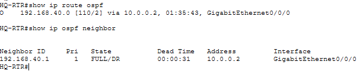

### What I learned

This was useful because it showed me that routing problems are not always caused by the routing protocol configuration itself.

When making changes to interfaces or security policies, I need to check the wider network and verify things such as:

* Interface status
* OSPF neighbours
* Routing tables
* Reachability between routers
* End-to-end connectivity

---

# What's Next

* [ ] Harden unused switch ports
* [ ] Add any further useful network services
* [ ] Start the Python/Netmiko automation stage
* [ ] Automate configuration backups
* [ ] Automate device information collection

---

# Project Status

**Core networking, routing, network services and initial security controls are now in place.**

The next stage is to finish testing the security configuration and then move into switch hardening and Python/Netmiko automation.
